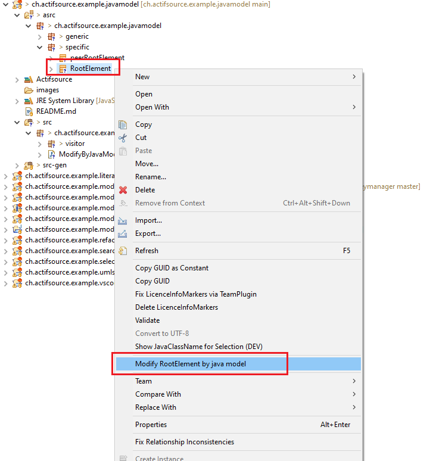

# Using JavaModel
The actifsource model can be queried or changed in a type-safe manner via the java model. 


## Example to run:

The example can be executed via the menu action and is located in the java class **ModifyByJavaModelActionAspect.java**

```
RootElement rootElement = new RootElement(TypeSystem.getCompatibleDynamicResourceRepository(modifiable), (Resource)selectedRootElement.getResource());
rootElement.setName("RootElement");
rootElement.setId(55);
RootElement peerRootElement = new RootElement(TypeSystem.getCompatibleDynamicResourceRepository(modifiable), new Resource("bd30d030-8d35-11ee-a7ca-3ba7c26ad18f"));
peerRootElement.setName("peerRootElement");
rootElement.setPeerRootElement(peerRootElement);

SubElement subElement1 = new SubElement();
subElement1.setName("SubElement1");
SubElement subElement2 = new SubElement();
subElement2.setName("SubElement2");
subElement2.setSubElementRef(CollectionUtil.asList(subElement2, subElement1));
rootElement.setSubElement(CollectionUtil.asList(subElement1, subElement2));

DecoElement decoElement = new DecoElement();
decoElement.setTarget(subElement1);
MultiMapOrdered<Resource, IDecoElement> decoMap = new MultiMapOrdered<>();
decoMap.put(new Resource(), decoElement);
rootElement.setDecoElement(decoMap);
```



## Requirements
Actifsource Workbench Community Edition

## License
[http://www.actifsource.com/company/license](http://www.actifsource.com/company/license)